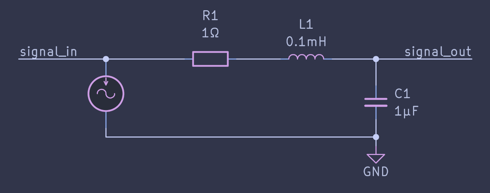
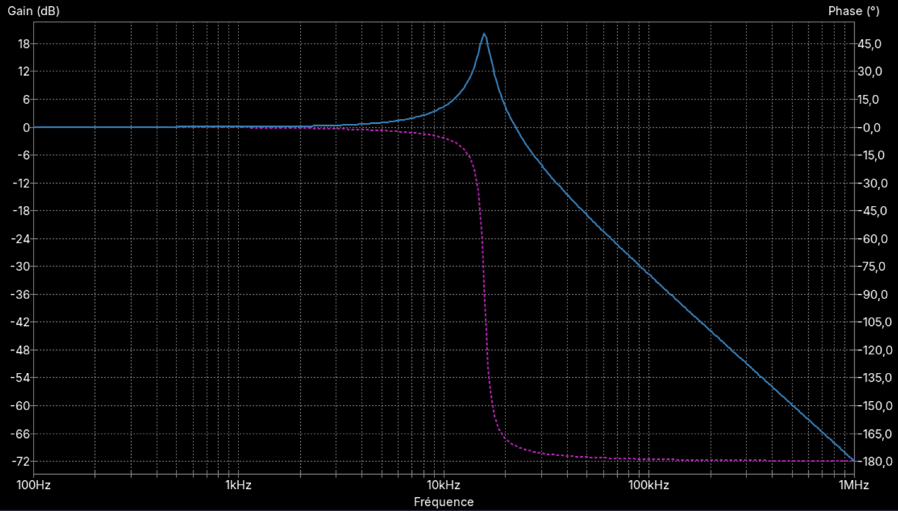
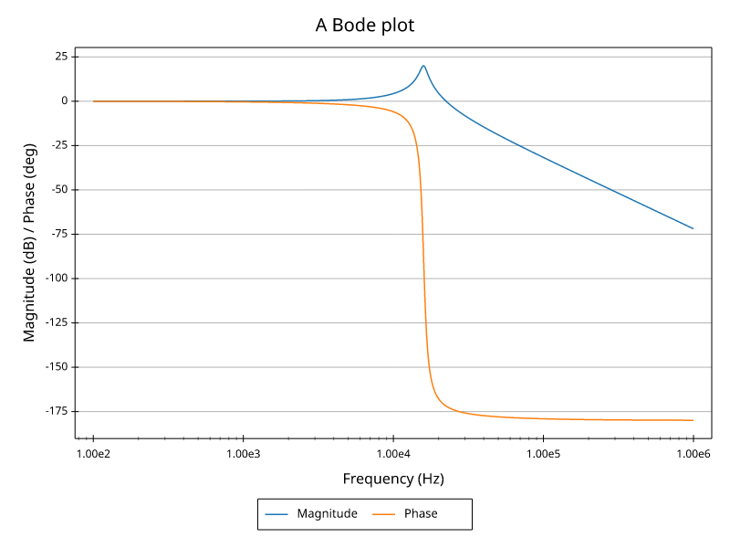
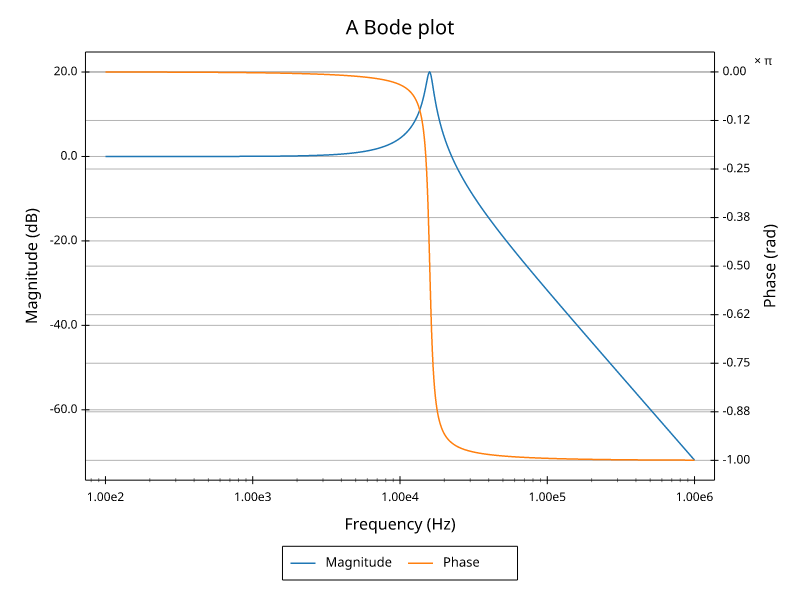
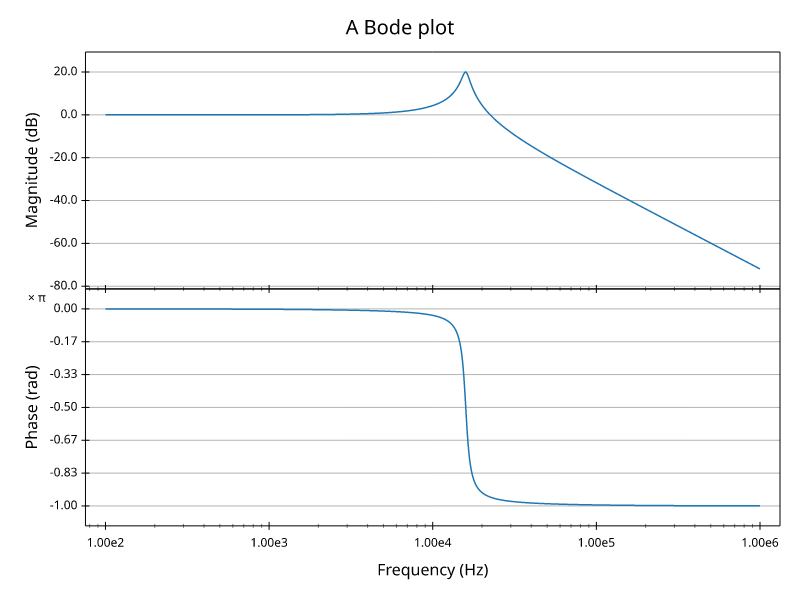
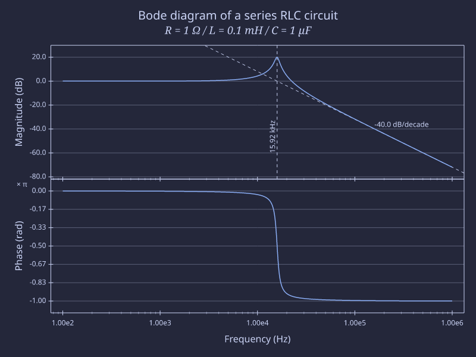

Tutorial
========

Installation
------------

Install the `plotive` package from `PyPI`:

.. code-block:: console

   (.venv) $ pip install plotive

Studied case: RLC circuit
-------------------------

The topic of this tutorial is to create analysis plot of a RLC circuit.
Here is the circuit we will study: a RLC series circuit, with output across capacitor.

The most common plot for such circuit in signal theory is the Bode diagram
of the transfer function.

Since we are in `KiCad`_, it is easy enough to perform a simulation of frequency response
with `Ngspice`_.  This will tell us what to expect.
Here is the Bode plot of the Ngspice simulation between 100Hz and 1MHz:

.. _KiCad: https://kicad.org
.. _Ngspice: https://ngspice.sourceforge.io

Let's see how to do something more styled than this with Python and plotive.

.. literalinclude:: code/tuto_rlc_1.py
    :language: python
    :linenos:

This results in the following figure.

Not too bad for a first run. At least we got the physics right.
Let's continue by giving the phase a proper scale in radians as it is what physicists like to use.

.. literalinclude:: code/tuto_rlc_2.py
    :language: python
    :linenos:
    :emphasize-lines: 27-28,40,41,44,52-59

Now the phase gets its own scale in radians (note the `× π` annotation) and both series fit the plot.
But the grid lines are not aligned and the end result doesn't look much better.

To get a better result we are going to separate magnitude and phase on two different plots.
This is how Bode plots are most often represented.
As we'll have only one series per plot, the legend is no longer needed.
We will also use a proper data source dict.

.. literalinclude:: code/tuto_rlc_3.py
    :language: python
    :linenos:
    :emphasize-lines: 39-69,72-76,83

It starts to look good.
Finally we use some rich text features for the title, we add some annotations and we set a modern style.

.. literalinclude:: code/tuto_rlc_4.py
    :language: python
    :linenos:
    :emphasize-lines: 37-43,46,63-83

Here is the final result:

In the `Gallery`_, there is a similar example with comparison of 3 resistor values.
The code is in the project examples: https://github.com/rtbo/plotive-py/blob/main/examples/bode_rlc.py

.. _Gallery: ./gallery.html#bode-diagram
